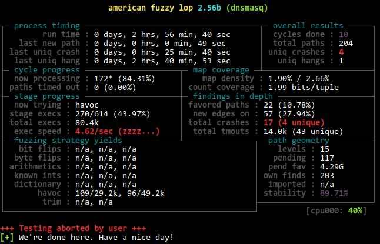

# Tutorial - Fuzzing Dnsmasq server

This assumes that you have read the AFLNet README.md, which includes a detailed tutorial for fuzzing the Live555 RTSP server, before reading this tutorial.

## Step-0. Server compilation & setup

You can download specific release versions from the [Dnsmasq download page](http://www.thekelleys.org.uk/dnsmasq/). In this example, we will be fuzzing v2.73rc6. To compile and setup this version of Dnsmasq, clone their repo and check out the specific tag:

```bash
# Assuming AFLNet is in ~/aflnet
export AFLNET=$HOME/aflnet
export WORKDIR=$HOME
export AFL_PATH=$AFLNET
if [[ ! $PATH == *"$AFLNET"* ]]; then export PATH=$AFLNET:$PATH; fi
cd ~
# Clone the Dnsmasq repository
git clone git://thekelleys.org.uk/dnsmasq.git
# Move to the directory
cd dnsmasq
# Checkout a specific version
git checkout v2.73rc6
# Compile source
CC=$AFLNET/afl-clang-fast make
# Copy configuration file
sudo cp $AFLNET/tutorials/dnsmasq/dnsmasq.conf /etc/
# Move to the src directory
cd src/
```

Once Dnsmasq has been successfully compiled, we can test the server by adding an address to resolve and using `dig` to query the hostname:
```bash
# Add an address to resolve
echo address=/test.com/5.5.5.5 | sudo tee -a /etc/dnsmasq.conf
# Run Dnsmasq and don't daemonize (the dnsmasq.conf file will specify port 5353)
./dnsmasq
```

Now we can use `dig` to query the test.com domain:
```
dig @127.0.0.1 -p 5353 test.com

; <<>> DiG 9.11.3-1ubuntu1.12-Ubuntu <<>> @127.0.0.1 -p 5353 test.com
; (1 server found)
;; global options: +cmd
;; Got answer:
;; ->>HEADER<<- opcode: QUERY, status: NOERROR, id: 40722
;; flags: qr aa rd ra ad; QUERY: 1, ANSWER: 1, AUTHORITY: 0, ADDITIONAL: 0

;; QUESTION SECTION:
;test.com.			IN	A

;; ANSWER SECTION:
test.com.		0	IN	A	5.5.5.5

;; Query time: 0 msec
;; SERVER: 127.0.0.1#5353(127.0.0.1)
;; WHEN: Tue May 19 14:19:38 EDT 2020
;; MSG SIZE  rcvd: 42
```

## Step-1. Prepare message sequences as seed inputs

Various DNS queries have been recorded and saved in the `aflnet/tutorials/dnsmasq/in-dns` directory for seed inputs. If you want to create your own inputs, please follow the tutorial for fuzzing Live555 RTSP server included in the main AFLNet README.md.

## Step-2. Fuzzing

```bash
cd $WORKDIR/dnsmasq/src
afl-fuzz -d -i $AFLNET/tutorials/dnsmasq/in-dns -o out-dns -N tcp://127.0.0.1/5353 -P DNS -D 10000 -K -R ./dnsmasq
```

With this particular version of Dnsmasq (v2.73rc6), you should get a few crash after waiting long enough.


